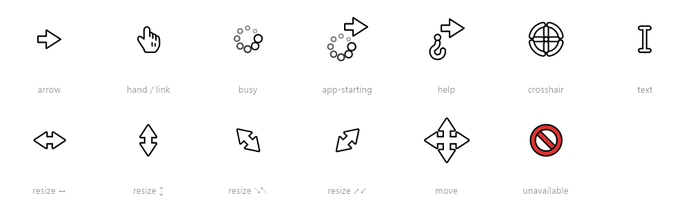

# WormsCursor


A tiny Windows tray utility that **rotates the mouse cursor to follow your movement
direction** — like the aiming arrow in *Worms 3D*. Move the mouse right and the arrow
points right; sweep it down and it smoothly slews to point down. The link/hand cursor
rotates the same way.

It runs in the background from the system tray, with no main window.

> ⚠️ **It replaces the system-wide arrow cursor** (`SetSystemCursor`) while running, so
> every app sees the rotated arrow. The defaults are restored on quit and on a crash,
> and WormsCursor reloads the real cursor scheme on every launch — so if it's ever
> killed outright (Task Manager "End Task", Visual Studio "Stop Debugging") and the
> cursor stays rotated, just starting it again clears it. To fix it without
> relaunching, run [`tools/RestoreCursor.ps1`](tools/RestoreCursor.ps1) (logging off
> resets it too).

## Demo

https://github.com/user-attachments/assets/c8095725-6cfe-4c99-b9f3-834460b1514c

_The cursor rotating to follow your mouse movement._

## Cursors

WormsCursor themes **all 14 standard system cursors**, each with its own physics-driven motion:



Generated by the **`WormsCursor.Preview`** tool:
`dotnet run --project src/WormsCursor.Preview -- assets/cursors.png` (writes a dark sheet
plus a transparent one).

## How it works

- At startup the engine pre-renders **360 rotated copies** of the arrow (one per degree)
  as cursors, each with the hotspot pinned to the arrow tip.
- A background loop polls the cursor position (144 Hz by default) and computes the
  movement direction from **accumulated travel**, so ±1 px jitter doesn't make the arrow
  wobble on straight or vertical moves.
- The displayed angle is **animated toward** the target direction (a fixed deg/s slew),
  so turns look smooth instead of snapping.
- Both the **arrow** (`OCR_NORMAL`) and the **hand/link** cursor (`OCR_HAND`) rotate. The
  hand is drawn the same way as the arrow — a filled silhouette plus a pen-stroked outline,
  finger separators and knuckle creases — so it shares the arrow's colour, size and outline
  thickness (the geometry is baked into `HandShape.cs`).
- The **busy / progress** cursors are themed too. *App-starting* (`OCR_APPSTARTING`) is the
  rotating arrow with a spinning ring of dots that hangs off its tail like a pendulum —
  swinging out as you move and settling when you stop — while *wait* (`OCR_WAIT`) is the
  same ring centred on the pointer (spin only). They animate only while actually on screen,
  so an idle tray costs nothing.
- The **help cursor** (`OCR_HELP`) hangs a "?" upside-down off the arrow's tail on the same
  string, swinging to the sides as you move and settling when you stop.
- The **crosshair** (`OCR_CROSS`) is a precision reticle — a centre dot, four ticks and a
  slowly-rotating broken ring; the ticks breathe and spread out (recoil) when you move fast,
  then settle.
- The **text / I-beam** cursor (`OCR_IBEAM`) is a flexible beam: the bottom stays rigid while
  the top sways opposite to your motion on a soft spring, wobbling like jelly and settling.
- The **resize** cursors (`OCR_SIZEWE` / `SIZENS` / `SIZENWSE` / `SIZENESW`) and the **move**
  cursor (`OCR_SIZEALL`) are stretched-taffy double-arrows — drag along an axis and the shaft
  necks thin while the heads fly apart on a spring, then blob back; move crosses a horizontal
  and a vertical taffy into a 4-way glyph.
- The **unavailable** cursor (`OCR_NO`) is a red circle-with-slash whose ring is a jelly blob:
  it deforms into an egg along the direction of travel and wobbles back to round.
- *Alternate-select* (`OCR_UP`) reuses the same rotating arrow.
- The animated cursors re-render **only while actually on screen** (matched via `GetCursorInfo`
  against the live system handle), so an idle tray uses no CPU.

## Project structure

```
WormsCursor.sln
├─ src/
│  ├─ WormsCursor.Core/      Engine — no UI dependencies
│  │   ├─ CursorEngine.cs     P/Invoke, cursor building, tracking + animation loop
│  │   ├─ ArrowRenderer.cs    Draws the arrow (size, colours, thickness, corner radius)
│  │   ├─ HandRenderer.cs     Draws the hand/link cursor (solid fill + baked line art)
│  │   ├─ ProgressRenderer.cs Draws the composited cursors (busy, help, crosshair, text, resize/move, unavailable)
│  │   ├─ HandShape.cs        Baked hand geometry (silhouette + crease marks)
│  │   ├─ CursorSettings.cs   Tunable parameters (persisted as JSON)
│  │   └─ SettingsStore.cs    Load/save settings in %LocalAppData%\WormsCursor\
│  ├─ WormsCursor.App/       Tray shell (WinForms, no main window)
│  │   ├─ Program.cs                   Entry point (Velopack hook + single-instance guard)
│  │   ├─ TrayApplicationContext.cs   NotifyIcon + menu, owns the engine
│  │   ├─ PreferencesForm.cs          Live settings dialog (size, colours, thickness, radius, test cursor)
│  │   ├─ SingleInstance.cs            One instance only; a 2nd launch opens Preferences
│  │   ├─ Autostart.cs                 "Start with Windows" via HKCU\…\Run
│  │   └─ Services/UpdateService.cs    Velopack check / download / apply updates
│  └─ WormsCursor.Preview/   Console tool — renders the cursor showcase PNGs (docs/README)
│      └─ Program.cs                    Dark + transparent sheets of every themed cursor
└─ tools/
   ├─ generate-icon.py       Builds Assets/Icon.ico (+icon.png) — the arrow glyph
   ├─ pack.ps1               Build a Velopack release locally (Setup.exe + Portable.zip)
   ├─ RELEASING.md           How to cut a release
   └─ RestoreCursor.ps1      Emergency restore of default cursors
```

The app/tray icon is the same arrow as a white glyph with a black frame (so it reads
on both dark and light taskbars), generated by `tools/generate-icon.py` (Pillow).
Regenerate after tweaking the shape/angle:

```powershell
python tools/generate-icon.py
```

The engine (`Core`) is deliberately UI-agnostic, so the tray shell could later be
swapped for WPF/WinUI — or packaged for the Microsoft Store — without touching the
cursor logic.

## Build & run

Requires the **.NET 8 SDK** (Windows). Open `WormsCursor.sln` in Visual Studio 2022+
and run, or from a terminal:

```powershell
dotnet build WormsCursor.sln
dotnet run --project src/WormsCursor.App
```

A tray icon appears. Right-click it for **Enabled / Start with Windows / Preferences… /
Check for updates… / Exit**; double-click toggles the effect on/off. Only one instance
runs — launching it again just opens **Preferences**. "Start with Windows" registers a
per-user `HKCU\…\Run` entry (no admin), which you can also manage from Task Manager →
Startup apps.

**Preferences…** opens a live editor for cursor **size**, **fill** and **outline
colour**, **outline thickness** and **corner radius**, with a live preview of **all the
cursors**, a **Test cursor** picker that forces a chosen cursor on screen, and
**Apply** / **Defaults** / **Check for updates** buttons. Settings are saved to
`%LocalAppData%\WormsCursor\settings.json` and persist across restarts — and across
updates, since they live outside the app folder.

### Standalone build (no .NET install on the target)

```powershell
dotnet publish src/WormsCursor.App -c Release -r win-x64 --self-contained true -p:PublishSingleFile=true
```

> Note: WinForms doesn't support trimming/NativeAOT, so a self-contained build is
> several tens of MB. A framework-dependent build is tiny but needs the
> *.NET 8 Desktop Runtime* installed.

## Releases

Installers and standalone builds are produced by [Velopack](https://velopack.io):
pushing a `v*` tag runs the release workflow (`.github/workflows/release.yml`), which
publishes a **`Setup.exe`** installer, a **`Portable.zip`** standalone, and delta
packages to the repo's GitHub Releases. To build one locally see
[`tools/RELEASING.md`](tools/RELEASING.md) (`pwsh tools/pack.ps1 -Version x.y.z`). The
app auto-updates from these releases (tray → **Check for updates…**, or the button in
Preferences).

## License

[MIT](LICENSE) © 2026 Dawid Wenderski
